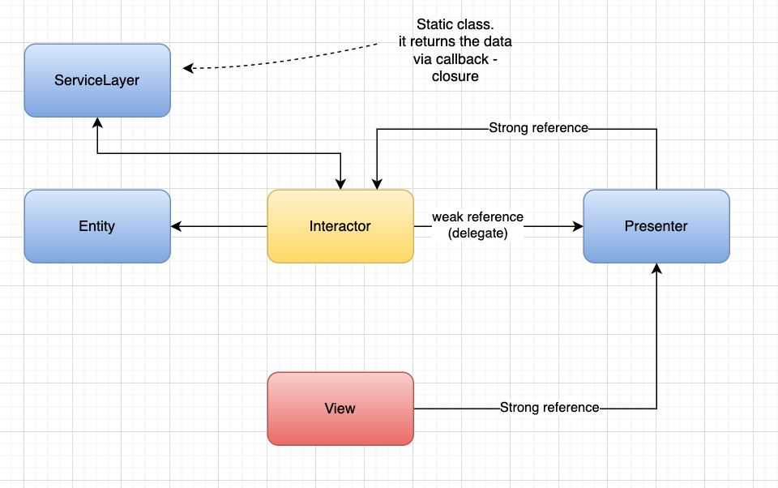

# breakingbad

This is a simple app that consumes the Breaking Bad api from [here](https://breakingbadapi.com/).


* I implemented the VIPER architecture not in a super strict way but still, I tried to respect the SOLID principle as much as I could considering the simplicity of the app. 
* The project could also be modified to use independency injection relatively effortless because I used polymorphism in several places, I could be more strict
but I didn't want to spend more time on it. 
* I used SwiftUI because I want to make clear I am familiar with it. In real life I would probably use an hybrid approach (for some complex screens/interfaces it
is better to use UIKit, which is way more mature).
* I wrote some unit tests, created mocked objects as needed. I targeted the two more important components of the app logic-wise. 


### Pods:
* Kingfisher: I like this package because I find it very useful with caching and requesting images from the urls. I always use it. 

### Why I didn't use any network related pods?
- Simply because I didn't find it necessary, I only consumed one endpoind. 

For the network layer it is worth to mention I implemented a `NetworkRouter` which basically helps me to build the route and `urlsession` with all the parameters
I need and a `ServiceLayer` class. I used generics so a typical request looks like this:

```
        ServiceLayer.request(router: .getCharacters) { (result: Result<[BreakingBadCharacter], Error>) in
            switch result {
            case .success(let data):
                // do something with the data here
            case .failure:
                print("error")
            }
        }
```

The `NetworkLayer` I implemented is heavily influenced by this [medium articule](https://rinradaswift.medium.com/networking-layer-in-swift-5-111b02db1639)

### Communication between components

The general idea is to use protocol-communication when a weak reference is required (to avoid retain cycles). I could use other methods but I ended up choosing this method for cleaningness of the code. 

The rest of communication was using the `Combine` framework with its binding, publishers,etc. 



